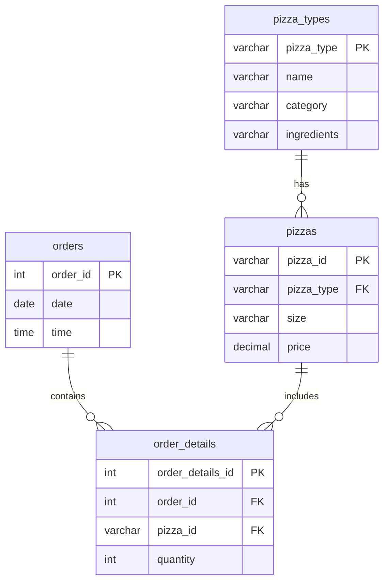

# Pizzaland — SQL Sales Analysis

A SQL project analyzing pizza sales data for a company, **Pizzaland**. The project covers database design and a set of business questions ranging from basic to advanced, solved using joins, aggregations, subqueries, and window functions.

## Schema

## Tables

| Table | Description |
|---|---|
| `orders` | Order id, date, and time |
| `order_details` | Line items linking orders to pizzas, with quantity |
| `pizzas` | Pizza id, size, price, and its type |
| `pizza_types` | Pizza name, category, and ingredients |

## Questions Solved

**Basic**
- Total number of orders placed
- Total revenue generated from pizza sales
- Highest-priced pizza
- Most common pizza size ordered
- Top 5 most ordered pizza types by quantity

**Intermediate**
- Total quantity ordered per pizza category
- Distribution of orders by hour of the day
- Category-wise distribution of pizzas
- Average number of pizzas ordered per day
- Top 3 most ordered pizza types by revenue

**Advanced**
- Percentage contribution of each pizza type to total revenue
- Cumulative revenue over time
- Top 3 most ordered pizza types by revenue, within each category

## Tools & Concepts Used

- Joins (INNER JOIN across multiple tables)
- Aggregate functions (`SUM`, `COUNT`, `AVG`, `MAX`)
- Subqueries
- Window functions (`SUM() OVER`, `RANK() OVER`)
- `GROUP BY`, `ORDER BY`, `EXTRACT`

## Files

- `Project_pizzaland(sql).sql` — full schema creation and all query solutions
- `Questions.txt` — the list of business questions this project answers

## Note

Pizzaland is a fictional company name used for this project.
